# Lab0 实验报告

**姓名：** 陈域圣　　**学号：** 25800440031

## 实验环境

- 系统：Windows 11 + WSL2（Ubuntu 24.04）
- 编辑器：VS Code，主要使用其内置 Source Control 图形界面完成 Git 操作
- 编译工具：gcc + 仓库自带 Makefile（`make` / `./main` / `make clean`）
- 实验截图统一存放于本仓库 `images/` 文件夹，报告中以相对路径引用

## 第一大题：Git 基础问题

**问题 1：你之前有过多人协同开发的经历吗？如果有，你们是使用什么方式分工协作的？**

1.曾经进行过多人协作开发，用的是git；

**问题 2：Git 为什么要设计“暂存-提交”两个步骤？**

2.因为写的代码不一定是符合要求的，如果写完直接提交有破坏代码库的可能，所以要先暂存然后再提交，避免错误代码污染代码仓库，确定没问题审核通过后再提交并入比较好；同时debug时如果不同人分别工作，等所有工作做好后一起提交比较方便。

**问题 3：`git branch` 和 `git branch -a` 的区别是什么？**

3.git branch是查看本地分支；git branch -a是查看本地和远程分支。可以方便的知晓本地工作区和远端代码仓库的分支情况。

## 第二大题：完成 main.c 的 TODO 并进行一次 commit

按 README 要求，将 `main.c` 中 `@TODO` 处的 `printf` 语句由模板的 `Hello, world!` 改为自己的句子，然后在 VS Code 的 Source Control 面板中将改动暂存（Stage）并提交，commit message 为 `first`。

修改代码并提交

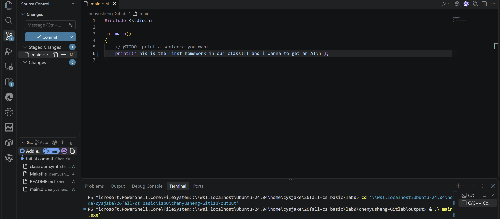

*图 1　修改 main.c 中的 TODO 并将改动暂存*

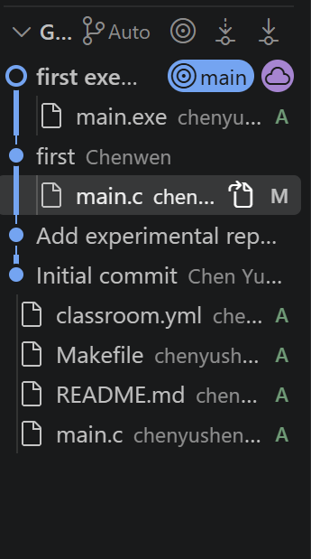

*图 2　提交完成，历史记录中可以看到新的提交*

编译与运行结果：

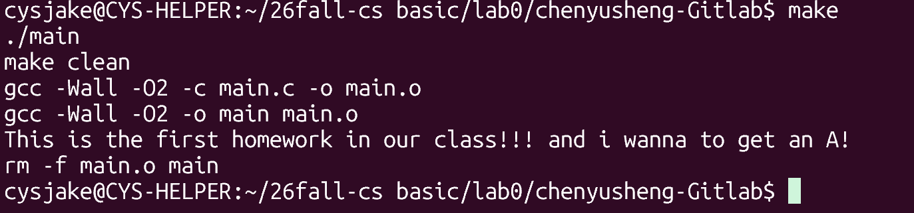

*图 3　`make` 编译、`./main` 运行与 `make clean` 的输出*

## 第三大题：

从三篇材料中选择了前两篇进行阅读：Commit Message 规范与 Git Flow 分支控制。

Commit Message规范：

要在规范中说明本次提交的目的。Commit message的作用是提供更多历史信息，方便预览，简单来说就是方便查找信息。  
angular格式要求：  
1：包含三个部分，header，body和footer，不能超过72个字符，分为多个内容；  
2：可以用commitizen来撰写符合要求的信息；  

如果所有commit都复合angular格式，那么可以使用git log --oneline --graph --decorate --all来查看提交历史，方便查找信息。

Gitflow分支规范：  
1：master分支：主分支，存放生产环境的代码，随时可以发布；  
2：develop分支：开发分支，存放开发环境的代码，随时可以发布；  
3：feature分支：功能分支，存放新功能的代码，开发完成后合并到develop分支；  
4：release分支：发布分支，存放准备发布的代码，开发完成后合并到master分支；  
5：hotfix分支：修复分支，存放紧急修复的代码，开发完成后合并到master分支。  

总的来说，顺序一般是：feature分支开发完成后合并到develop分支，release分支开发完成后合并到master分支，hotfix分支开发完成后合并到master分支。  
还要注意版本号格式和分支命名，注意版本号不带.

我的理解：这是团队开发的基石。只有使用git，才能方便进行团队协作，并且很好地回顾旧版本的代码，使得整个团队的开发效率更高。  
同时在代码稳定性上，Gitflow分支规范是团队协作的基础，只有遵守规范，才能保证代码的质量和稳定性。

## 第四大题：分支管理与合并冲突

### 1. 新建 feature 分支

新建分支：（这是我新建的分支，一开始忘记截图了，只能在此截图）

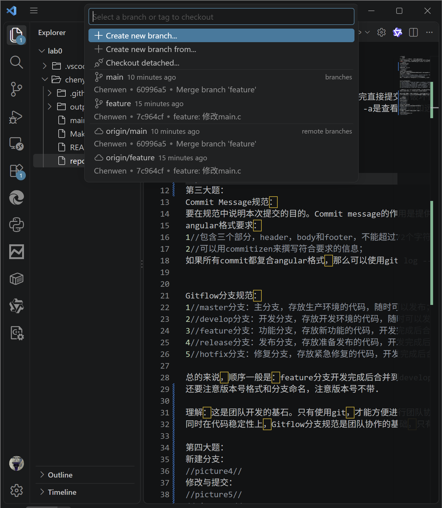

*图 4　通过 VS Code 的分支菜单从 main 分支创建并切换到 feature 分支*

### 2. 在 main 与 feature 分支上分别修改并提交

修改与提交：（两个内容我用了不同的话来改）

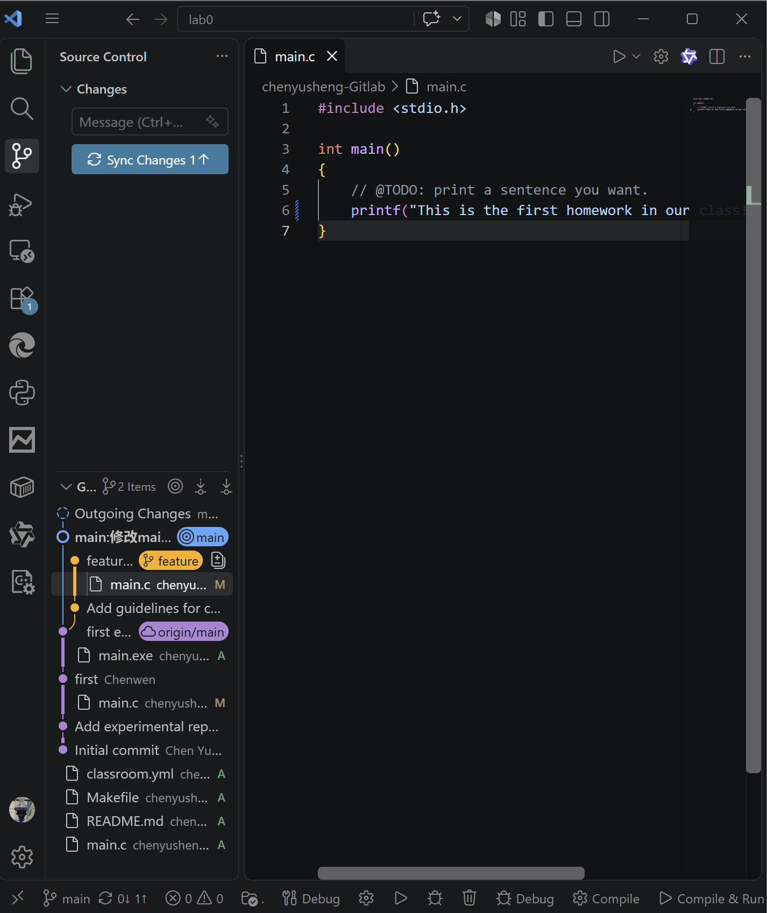

*图 5　main 分支与 feature 分支上各自的修改和提交*

分别是不同的内容

具体来说：在 main 分支上把 `printf` 一句改为 `"This is the first homework in our class!!!"`（commit：`main:修改main.c`），在 feature 分支上则改为 `"I wanna to get an A!"`（commit：`feature: 修改main.c`）。由于两个分支修改的是 `main.c` 的同一行，切换回 main 执行 `git merge feature` 时出现了冲突。

### 冲突的原因：同一行出现了不同内容，合并的时候要以谁为准？这个时候就会有冲突，需要我们自己来选择。

### 3. 冲突细节

合并时出错了，vscode跳了以下内容：

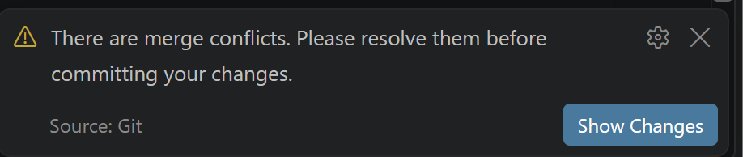

*图 6　VS Code 提示存在合并冲突，要求先解决才能继续提交*

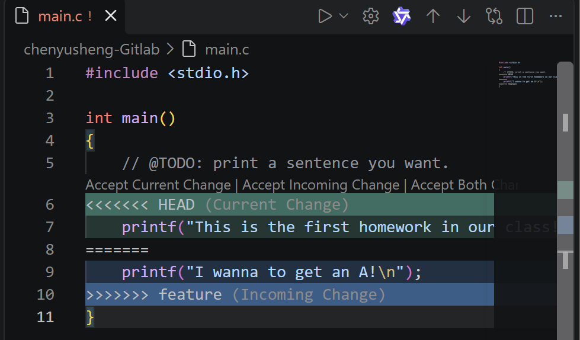

*图 7　main.c 中出现的冲突标记：`<<<<<<< HEAD` 到 `=======` 是 main 分支的当前内容，`=======` 到 `>>>>>>> feature` 是 feature 分支传入的内容*

### 4. 解决冲突

解决方法：

选择了一个分支，以这个分支为准。

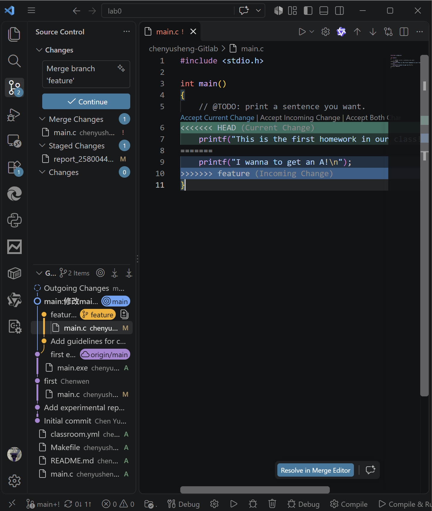

*图 8　合并进行中，选择保留 main 分支的版本（Accept Current Change），删除冲突标记后继续完成合并提交*

解决完问题后的结果：

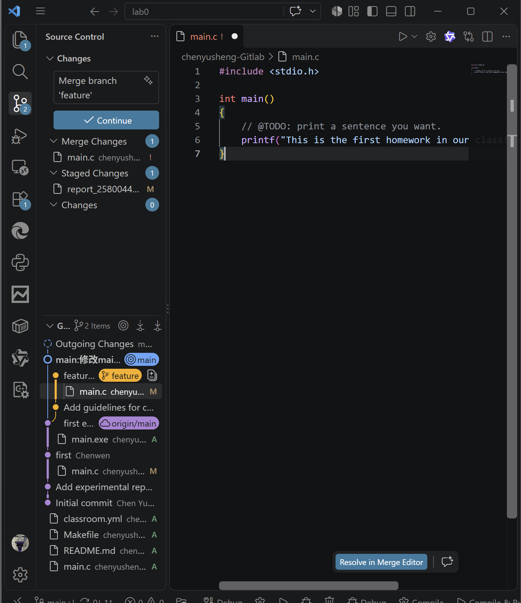

*图 9　冲突解决后的 main.c，恢复为所选版本*

### 5. 验证合并结果

最后的文件树和具体细节：

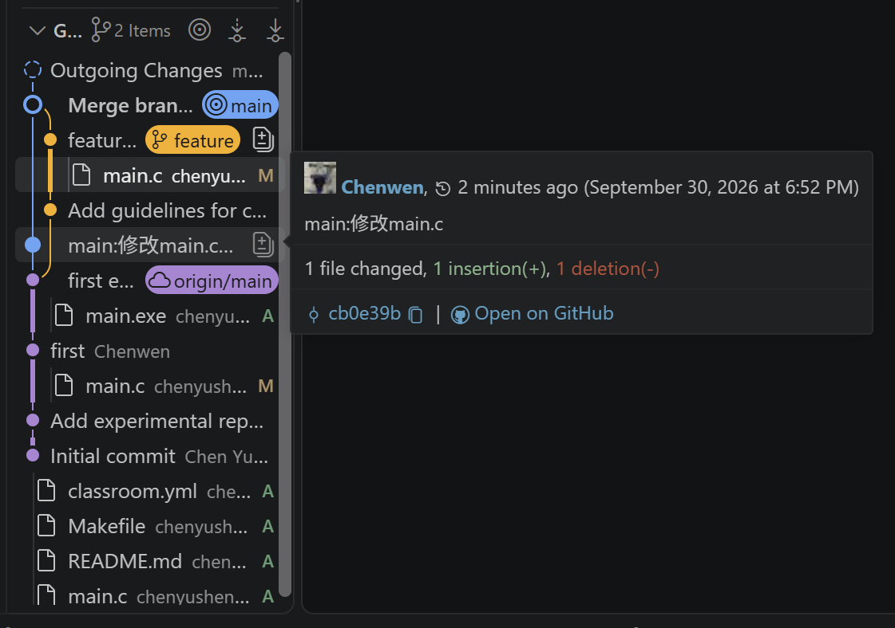

*图 10　合并相关提交的文件树与细节*

通过命令行验证结果正确：

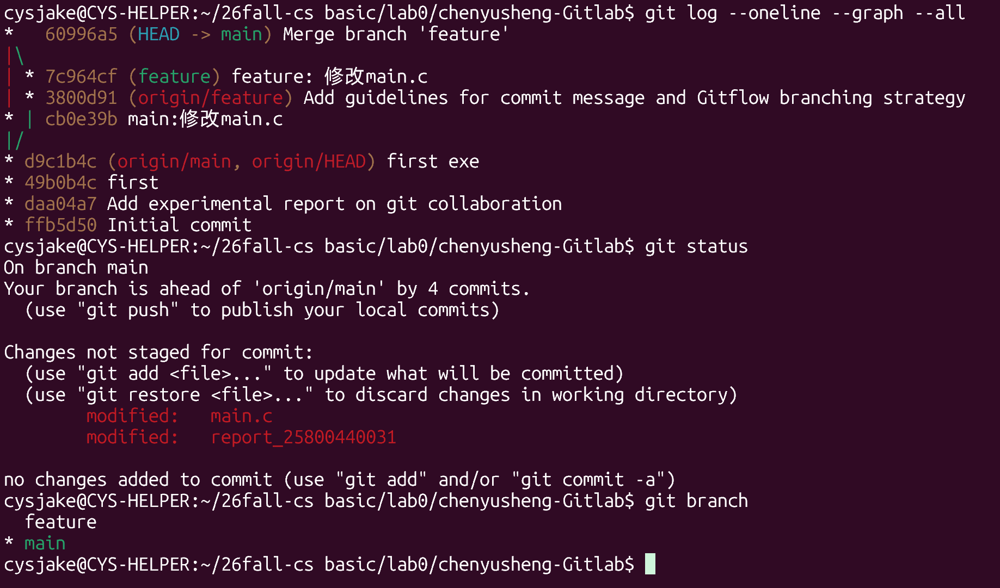

*图 11　`git log --oneline --graph --all` 显示 main 与 feature 两条提交线在 merge commit 处汇合，`git status` 与 `git branch` 确认当前状态正常*

从命令行输出可以看到，feature 分支上的提交已经通过 merge commit（`60996a5 Merge branch 'feature'`）合入 main，提交图呈分叉后再汇合的形状，说明冲突已解决、合并成功。

## 小结

本次实验完整走了一遍“修改代码 → 暂存 → 提交 → 新建分支 → 双线开发 → 合并并解决冲突”的 Git 工作流。通过在 main 与 feature 分支上修改同一行代码并手动解决合并冲突，直观理解了冲突产生的原因与解决方式；此外，结合第三大题的阅读，也体会到 commit message 规范与 Git Flow 分支模型对团队协作的意义。
